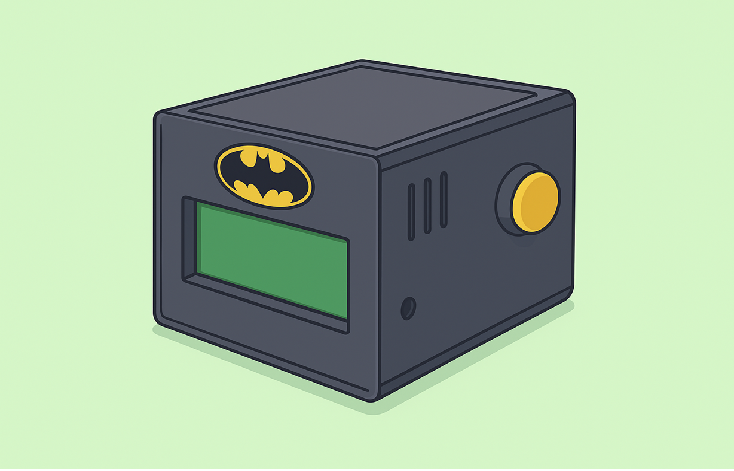

# Proyecto - Diseño 3D.

`Objetivo`: Diseñar en 3D un **gabinete/carcasa** que permita guardar, proteger y organizar los componentes de tu proyecto electrónico.

*Consigna*:

1. El gabinete debe ser diseñado en un software de modelado 3D - `Tinkercad`.

2. El diseño debe tener en cuenta:
- Espacio interno suficiente para alojar todos los componentes del proyecto.
- Orificios o ranuras para **cables, posibles botones y pantallas LCD**.
- Una tapa o sistema de cierre que permita acceder al interior.
- Dimensiones realistas.

3. Personalizar el diseño con logotipos, iniciales o figuras decorativas relacionadas con el proyecto.

4. Entregar el archivo comprimido en formato `.rar` y el archivo 3D en formato `.stl` o `.obj` para poder imprimirlo.

5. Junto con el archivo, presentar un esquema sencillo *Puede ser a mano o digital* que explique dónde se ubicará cada componente dentro del gabinete.

